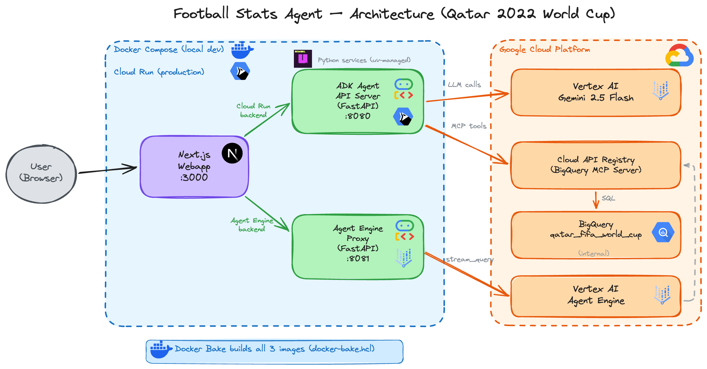

# End-to-End AI Agent on GCP: ADK, BigQuery MCP, Agent Engine, and Cloud Run

## How I built a football statistics assistant using Google's Agent Development Kit, BigQuery via Cloud API Registry MCP, and deployed it to Google Cloud



---

AI agents are moving from prototypes to production. But building one that connects to real data, uses managed tools, and deploys to the cloud with CI/CD — that's where things get interesting.

In this article, I'll walk you through how I built a **football statistics agent** for the Qatar 2022 World Cup using:

- **Google ADK** (Agent Development Kit) as the agent framework
- **BigQuery MCP** via Cloud API Registry as the data tool
- **Gemini 2.5 Flash** as the LLM
- **Cloud Run** and **Vertex AI Agent Engine** as deployment targets
- **Docker Bake**, **Docker Compose**, and **Cloud Build** for builds and CI/CD

The agent answers natural language questions like *"Who scored the most goals in the 2022 World Cup?"* by generating and executing SQL queries against BigQuery — all powered by the MCP protocol.

The full source code is available on [GitHub](https://github.com/tosun-si/football-agent-adk).

---

## Architecture overview

The project has 3 services:

| Service | Description | Tech |
|---------|-------------|------|
| **ADK Agent API** | REST API exposing the football stats agent | Google ADK, FastAPI, Python |
| **Agent Engine Proxy** | Proxy for Vertex AI Agent Engine streaming API | FastAPI, Python |
| **Webapp** | Chat UI with backend toggle | Next.js, TypeScript |

There are two deployment paths to Google Cloud:
- **Cloud Run** — Stateless REST API via `adk api_server`
- **Vertex AI Agent Engine** — Managed agent with Playground UI

---

## What is Google ADK?

[Google ADK](https://github.com/google/adk-python) (Agent Development Kit) is Google's open-source framework for building AI agents in Python. It provides `LlmAgent`, a high-level abstraction that connects an LLM to tools, handles conversation flow, and exposes the agent as an API or web UI.

What makes ADK powerful is its native integration with the Google Cloud ecosystem: Vertex AI models, Cloud API Registry for MCP tools, and Agent Engine for managed deployment.

---

## Connecting to BigQuery via Cloud API Registry MCP

The key innovation here is **Cloud API Registry**. Instead of running your own MCP server, Google provides a **managed MCP server for BigQuery** through the API Registry. The agent connects to it with just a few lines of code — no infrastructure to manage.

Here's the `pyproject.toml` — only two dependencies are needed:

```toml
[project]
name = "football-agent-adk"
version = "0.1.0"
requires-python = ">=3.11"
dependencies = [
    "google-adk>=1.27.2",
    "google-cloud-aiplatform>=1.141.0",
]
```

And the core of `agent.py`:

```python
from google.adk.agents import LlmAgent
from google.adk.tools.api_registry import ApiRegistry

PROJECT_ID = os.environ.get("GCP_PROJECT_ID", "gb-poc-373711")
REGISTRY_LOCATION = "global"
MODEL = "gemini-2.5-flash"

def get_header(context):
    return {"x-goog-user-project": PROJECT_ID}

def create_agent():
    tool_registry = ApiRegistry(
        PROJECT_ID,
        location=REGISTRY_LOCATION,
        header_provider=get_header
    )

    mcp_server_name = (
        f"projects/{PROJECT_ID}/locations/{REGISTRY_LOCATION}"
        f"/mcpServers/google-bigquery.googleapis.com-mcp"
    )
    toolset = tool_registry.get_toolset(mcp_server_name)

    return LlmAgent(
        model=MODEL,
        name="football_stats_agent",
        instruction=SYSTEM_INSTRUCTION,
        tools=[toolset],
    )

root_agent = create_agent()
```

That's it. The `ApiRegistry` discovers the BigQuery MCP server, and `get_toolset()` returns the tools (`execute_sql`, `get_table_info`, etc.) that the agent can use. No local MCP server, no configuration files — just a managed connection to BigQuery.

The `SYSTEM_INSTRUCTION` contains the table schema, column descriptions, and business rules so the LLM knows how to generate correct SQL queries. This is critical because the table uses camelCase column names and stores numeric values as strings — the instruction tells the agent to use `SAFE_CAST()` for aggregation.

---

## Dataset: loading the football stats into BigQuery

The repository includes the raw dataset in the `raw_data/` folder so you can reproduce the full setup with your own GCP project:

- `world_cup_team_players_stats_raw_ndjson.json` — Qatar 2022 World Cup player statistics in NDJSON format
- `create_and_load_team_stats_raw_table.sh` — a script that loads the data into BigQuery

To load the data, first upload the NDJSON file to a GCS bucket, then run:

```bash
export PROJECT_ID=your-gcp-project-id
export REGION=europe-west1
export BUCKET_PATH=your-bucket-name/path

./raw_data/create_and_load_team_stats_raw_table.sh
```

The script uses `bq load` with `--autodetect` to create the `qatar_fifa_world_cup.team_players_stat_raw` table and infer the schema from the NDJSON data.

---

## Running the agent locally

ADK provides built-in tools for local development:

```bash
# Install dependencies
uv sync

# Run the agent with ADK's web UI
uv run adk web
```

This starts a local web UI at `http://localhost:8000` where you can interact with the agent directly — useful for testing prompts and verifying SQL generation before deploying.

You can also run all 3 services locally with Docker Compose:

```bash
# Build all images
docker buildx bake

# Set the Agent Engine ID (required by the proxy)
export ENGINE_ID=your-engine-id

# Start all services
docker compose up
```

This starts the ADK Agent API on `http://localhost:8080`, the Agent Engine Proxy on `http://localhost:8081`, and the Webapp on `http://localhost:3000`. GCP credentials are mounted from the host via `gcloud auth application-default login` (Application Default Credentials).

The `ENGINE_ID` must match an engine deployed with `adk deploy agent_engine` (which exposes `async_create_session` and `async_stream_query` methods). Engines deployed with custom Python classes use a different API and won't work with the proxy.

---

## Two deployment paths: Cloud Run vs Agent Engine

ADK offers two ways to deploy your agent to Google Cloud. Each has its own trade-offs.

### Cloud Run: direct API

The simplest path. The `adk api_server` command exposes your agent as a REST API. You package it in a Docker container and deploy to Cloud Run. The agent handles its own MCP connection to BigQuery directly.

**Pros:**
- Simple — one container, one service, no proxy needed
- Cost-effective — pay only for request duration (Cloud Run scales to zero)
- Full control — standard REST API with Swagger UI at `/docs`

**Cons:**
- Self-managed — you handle scaling configuration, health checks, and monitoring
- No built-in Playground UI

### Agent Engine: managed runtime

Agent Engine is Google's managed runtime for AI agents on Vertex AI. It handles versioning, provides a Playground UI in the console, and integrates with the Vertex AI ecosystem.

However, **Agent Engine doesn't expose a public REST API directly**. To call it from a webapp or external service, you need to build your own proxy. In this project, the proxy is a small FastAPI service deployed on Cloud Run — keeping everything serverless and simple.

**Pros:**
- Managed — Google handles infrastructure and scaling
- Playground UI — test the agent directly from the GCP console
- Vertex AI integration — versioning, monitoring, and observability built-in

**Cons:**
- Requires a proxy — no direct public REST API, so you need an additional service to expose it
- Slightly higher cost — Agent Engine adds managed service pricing (compute-based, not per-query) on top of model costs, and the proxy requires a second Cloud Run service (though both scale to zero when idle)
- Session requirement — you must create a session before each query (more on this below)

**For most use cases, the Cloud Run path is simpler and cheaper.** Agent Engine becomes valuable when you need managed versioning, the Playground UI, or deeper Vertex AI integration.

---

## Deploying to Cloud Run

For the Cloud Run deployment, the agent is packaged with a multi-stage Dockerfile using `uv`:

```dockerfile
FROM ghcr.io/astral-sh/uv:python3.11-bookworm-slim AS builder

ENV APP_DIR=/usr/local/src/app
WORKDIR ${APP_DIR}

COPY pyproject.toml uv.lock ./
RUN --mount=type=cache,target=/root/.cache/uv \
    uv sync --frozen --no-dev --no-install-project
COPY agent_config.yaml ./
COPY football_stats_agent/ ./football_stats_agent/
RUN --mount=type=cache,target=/root/.cache/uv \
    uv sync --frozen --no-dev

FROM python:3.11-slim

ENV APP_DIR=/usr/local/src/app

RUN groupadd --gid 1001 appuser && \
    useradd --uid 1001 --gid 1001 --create-home appuser
WORKDIR /agents
COPY --from=builder --chown=appuser:appuser ${APP_DIR}/.venv ${APP_DIR}/.venv
COPY --from=builder --chown=appuser:appuser \
    ${APP_DIR}/football_stats_agent/ ./football_stats_agent/
ENV PATH="${APP_DIR}/.venv/bin:$PATH"
USER appuser

ENTRYPOINT ["adk"]
CMD ["api_server", "--host", "0.0.0.0", "--port", "8080"]
```

Key details:
- **`uv` base image** — The builder uses `ghcr.io/astral-sh/uv:python3.11-bookworm-slim` which includes both Python and uv, instead of copying uv into a separate Python image
- **`APP_DIR` variable** — Avoids hardcoded paths across stages
- **Multi-stage build** — Dependencies are installed in the builder stage, then only the `.venv` is copied to the runtime image
- **`uv` cache mount** — `--mount=type=cache` avoids re-downloading packages on every build
- **Non-root user** — The container runs as `appuser` (UID 1001) for security
- **`WORKDIR /agents`** — ADK discovers the agent package by convention from this directory
- **Split `ENTRYPOINT`/`CMD`** — Makes it easy to override arguments without replacing the executable

Deploy to Cloud Run with:

```bash
gcloud run deploy football-stats-api \
    --image ${REGISTRY}/football-stats-api:latest \
    --region europe-west1 \
    --platform managed \
    --allow-unauthenticated \
    --port 8080 \
    --set-env-vars=GCP_PROJECT_ID=${PROJECT_ID} \
    --set-env-vars=LOCATION=europe-west1 \
    --set-env-vars=GOOGLE_GENAI_USE_VERTEXAI=True
```

---

## Deploying to Vertex AI Agent Engine

Deployment uses the `adk deploy` CLI:

```bash
uv run adk deploy agent_engine \
    --project "$PROJECT_ID" \
    --region "$LOCATION" \
    --display_name "football-stats-agent" \
    football_stats_agent
```

In this article, we use the `adk deploy agent_engine` CLI, which handles serialization automatically and enables the Playground UI. Note that passing `AdkApp` directly to `ReasoningEngine.create()` fails with pickling errors due to MCP toolsets. An alternative Python approach using `ModuleAgent` via `agent_engines.create()` also works — it uploads the agent as a Python module, avoiding serialization entirely. The `create_app()` function in the agent code wraps the agent in `AdkApp`, which is useful for this programmatic deployment path.

### The Agent Engine Proxy

Since Agent Engine doesn't expose a public REST API, we need a proxy to make it accessible from the webapp. The proxy is a small FastAPI service deployed on Cloud Run that:

1. **Creates a session** before each query (`async_create_session`)
2. **Streams the query** with the session ID (`async_stream_query`)
3. **Extracts the final text** response from the streaming events

The session is critical — without it, the MCP connection to BigQuery drops before the agent can complete its full reasoning loop (tool call → BigQuery result → text response). This was a hard-won lesson and is not clearly documented.

Here's the proxy code:

```python
def _create_session() -> str:
    """Create a session and return its ID."""
    response = client.query_reasoning_engine(
        request=aiplatform_v1beta1.types.QueryReasoningEngineRequest(
            name=RESOURCE_NAME,
            class_method="async_create_session",
            input={"user_id": USER_ID},
        ),
        timeout=30,
    )
    return response.output.get("id")


def _extract_text(event_data: bytes) -> Optional[str]:
    """Extract text from a streaming event."""
    data = json.loads(event_data.decode("utf-8"))
    parts = data.get("content", {}).get("parts", [])
    texts = [
        part["text"] for part in parts
        if isinstance(part, dict) and part.get("text")
    ]
    return texts[-1] if texts else None


def _stream_query(message: str, session_id: str) -> str:
    """Stream a query and return the final text response."""
    response_stream = client.stream_query_reasoning_engine(
        request=aiplatform_v1beta1.types.StreamQueryReasoningEngineRequest(
            name=RESOURCE_NAME,
            class_method="async_stream_query",
            input={
                "message": message,
                "user_id": USER_ID,
                "session_id": session_id,
            },
        ),
        timeout=120,
    )

    texts = []
    for event in response_stream:
        if event.data:
            text = _extract_text(event.data)
            if text:
                texts.append(text)

    # The stream emits multiple events (function_call, function_response, text).
    # The last text is always the agent's final, formatted answer to the user.
    return texts[-1] if texts else ""


@app.post("/query", response_model=QueryResponse)
async def query_agent(request: QueryRequest):
    try:
        session_id = _create_session()
        text = _stream_query(request.message, session_id)
        return QueryResponse(response=text or "No response from agent")
    except Exception as e:
        logger.error("Agent Engine error: %s", e)
        raise HTTPException(status_code=502, detail=str(e))
```

The proxy needs the `ENGINE_ID` environment variable to know which Agent Engine instance to target. Each time you run `adk deploy agent_engine`, a new engine is created with a new ID.

---

## Docker Bake: centralized builds with registry cache

Instead of managing separate `docker build` commands for 3 services, I use **Docker Bake** with a single `docker-bake-agentic-apps.hcl` file:

```hcl
variable "REGISTRY" {
  default = "${LOCATION}-docker.pkg.dev/${PROJECT_ID}/${REPO_NAME}"
}

group "default" {
  targets = ["adk-agent", "agent-engine-proxy", "webapp"]
}

target "adk-agent" {
  context    = "."
  dockerfile = "Dockerfile"
  tags       = ["${REGISTRY}/football-stats-api:latest"]
  cache-from = ["type=registry,ref=${REGISTRY}/football-stats-api:cache"]
  cache-to   = ["type=registry,ref=${REGISTRY}/football-stats-api:cache,mode=max"]
}

target "agent-engine-proxy" {
  context    = "./agent_engine_proxy"
  dockerfile = "Dockerfile"
  tags       = ["${REGISTRY}/agent-engine-proxy:latest"]
  cache-from = ["type=registry,ref=${REGISTRY}/agent-engine-proxy:cache"]
  cache-to   = ["type=registry,ref=${REGISTRY}/agent-engine-proxy:cache,mode=max"]
}
```

One command builds all 3 images:

```bash
docker buildx bake
```

The `cache-from`/`cache-to` with `type=registry` and `mode=max` caches all layers in Artifact Registry — not just the final layer. This means CI/CD pipelines reuse cached layers across runs, significantly speeding up builds when only application code changes.

---

## CI/CD with Cloud Build

The entire pipeline is defined in a single `deploy-services-to-cloud-run.yaml` with 3 steps:

**Step 1 — Build & push** all 3 images with Docker Bake and registry cache:

```yaml
- name: 'gcr.io/cloud-builders/docker'
  script: |
    docker buildx create --use
    export REGISTRY="${LOCATION}-docker.pkg.dev/${PROJECT_ID}/${REPO_NAME}"
    docker buildx bake -f docker-bake-agentic-apps.hcl --push
  env:
    - 'PROJECT_ID=${PROJECT_ID}'
    - 'LOCATION=${LOCATION}'
    - 'REPO_NAME=internal-images'
```

**Step 2 — Deploy Agent Engine** using the `uv:python3.11-alpine` image. This image is much smaller and faster than the gcloud SDK image. Only `google-adk` is installed — not the full project dependencies — since we only need the `adk deploy` CLI:

```yaml
- name: 'ghcr.io/astral-sh/uv:python3.11-alpine'
  script: |
    uv pip install --system google-adk
    adk deploy agent_engine \
      --project "${PROJECT_ID}" \
      --region "${LOCATION}" \
      --display_name "football-stats-agent" \
      football_stats_agent
  env:
    - 'PROJECT_ID=${PROJECT_ID}'
    - 'LOCATION=${LOCATION}'
```

**Step 3 — Deploy all 3 Cloud Run services**. The Agent Engine Proxy needs the Engine ID to know which agent instance to call. Since step 2 creates a new engine each time, we retrieve the latest deployed Engine ID via the Vertex AI REST API and pass it to the proxy as an environment variable:

```yaml
- name: 'gcr.io/google.com/cloudsdktool/google-cloud-cli:slim'
  script: |
    ENGINE_ID=$(curl -s \
      -H "Authorization: Bearer $(gcloud auth print-access-token)" \
      "https://${LOCATION}-aiplatform.googleapis.com/v1beta1/..." \
      | grep 'reasoningEngines/' | head -1 \
      | grep -o 'reasoningEngines/[0-9]*' | cut -d'/' -f2)

    gcloud run deploy football-stats-api ...
    gcloud run deploy agent-engine-proxy \
      --set-env-vars=ENGINE_ID=${ENGINE_ID} ...
    gcloud run deploy football-stats-webapp ...
```

We use `google-cloud-cli:slim` instead of `stable` because the `slim` variant includes tools like `curl`, which is needed to call the Vertex AI REST API for Engine ID retrieval.

The pipeline uses Cloud Build predefined substitutions `$PROJECT_ID` and `$LOCATION` from the `--project` and `--region` flags — no custom substitutions needed.

Run the pipeline:

```bash
gcloud builds submit \
    --config deploy-services-to-cloud-run.yaml \
    --project gb-poc-373711 \
    --region europe-west1
```

---

## IAM permissions

The following roles are required for the user and relevant service accounts:

| Role | Purpose |
|------|---------|
| `roles/mcp.toolUser` | Access MCP tools via Cloud API Registry |
| `roles/cloudapiregistry.viewer` | Discover MCP servers in the API Registry |
| `roles/bigquery.dataViewer` | Read BigQuery data |
| `roles/bigquery.jobUser` | Run BigQuery queries |
| `roles/aiplatform.user` | Call Vertex AI models and Agent Engine |

The `cloudapiregistry.viewer` role is easy to miss — without it, the deployment fails with "MCP server not found."

---

## Webapp: a chat UI with backend toggle

The webapp is a simple Next.js chat interface that lets you interact with the agent and **toggle between the two backends** — Cloud Run (ADK API) and Agent Engine (via the proxy).

It uses Next.js API routes as a backend-for-frontend layer: the browser sends messages to `/api/cloud-run` or `/api/agent-engine`, which proxy the request to the corresponding Cloud Run service. This keeps backend URLs and credentials server-side.

The backend URLs are configured via environment variables (`CLOUD_RUN_API_URL`, `AGENT_ENGINE_PROXY_URL`), loaded from `.envrc` locally or set by Cloud Run at deploy time.

<!-- Screenshots: Cloud Run response / Agent Engine response -->

---

## Key takeaways

1. **Cloud API Registry simplifies MCP** — No need to run your own MCP server. Google manages the BigQuery MCP server, and ADK's `ApiRegistry` connects to it in a few lines of code.

2. **Agent Engine requires sessions** — When using the streaming API, always create a session before querying. Without it, the MCP connection drops before the agent completes its reasoning loop. This is not documented clearly and was a painful discovery.

3. **Cloud Run vs Agent Engine** — Cloud Run is simpler and cheaper for most use cases. Agent Engine adds managed versioning and a Playground UI but requires an additional proxy service to expose a public API.

4. **`adk deploy` over custom scripts** — The CLI handles MCP toolset serialization correctly. Passing `AdkApp` directly to `ReasoningEngine.create()` fails with pickling errors. A Python alternative exists using `ModuleAgent` via `agent_engines.create()`, which avoids serialization by uploading the agent as a module.

5. **MCP toolsets are unstable in Agent Engine** — After inactivity, Agent Engine freezes/thaws the process instead of fully restarting it. The MCP connection goes stale and tool calls fail with `McpError: Connection closed`. A redeployment is required to restore it. Using custom function tools (stateless BigQuery client calls) instead of MCP toolsets would avoid this. For production, **prefer the Cloud Run path**, which handles cold starts correctly.

6. **Docker Bake with registry cache** — Centralizes multi-service builds and dramatically speeds up CI/CD with layer caching in Artifact Registry.

7. **System instructions matter** — The agent's accuracy depends heavily on the system instruction. Include the full table schema, column types, naming conventions (camelCase!), and business rules for calculations.

---

## Try it yourself

The full source code is available on [GitHub](https://github.com/tosun-si/football-agent-adk). Clone it, set up your GCP project, and ask the agent about the 2022 World Cup:

- *"Who scored the most goals?"*
- *"Show me the top 5 players by assists"*
- *"Which goalkeepers had the highest save percentage?"*
- *"Compare France and Argentina players by performance rating"*

---

*If you found this article helpful, follow me on [Medium](https://medium.com/@mazlum.tosun) for more articles on AI agents, Google Cloud, and data engineering.*
